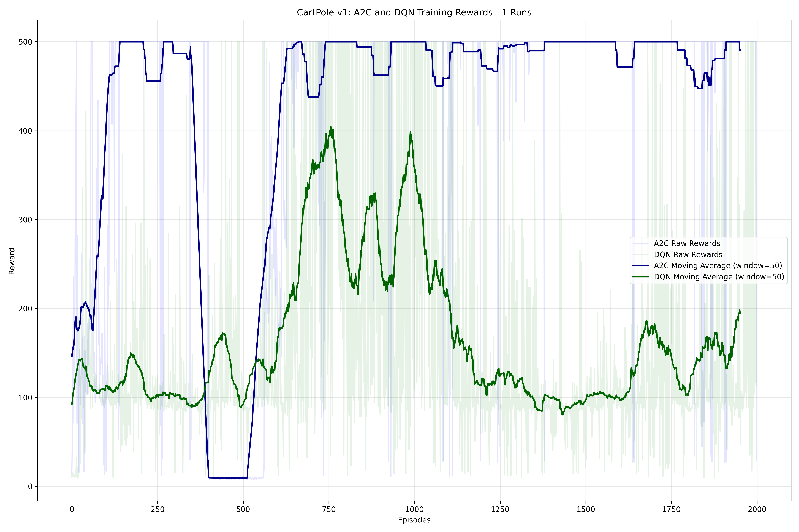
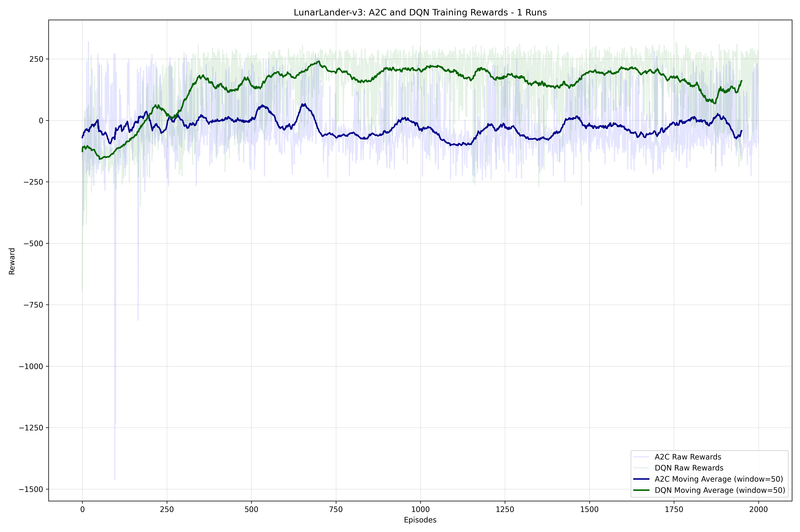
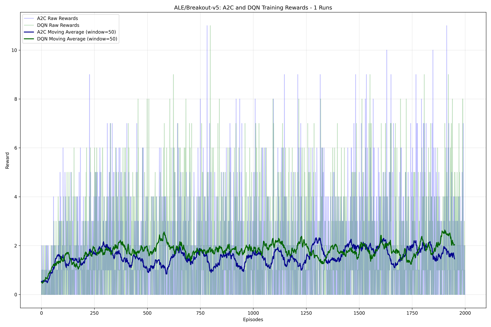

[](https://classroom.github.com/a/jBOTFJJA)

# Compare RL Algorithms

## Cartpole Comparison




## Lunar Lander Comparison



## Breakout Comparison




## Models

The models generated in the experiments are available in the `models` directory.


# Usage

## Installation Requirements

Before using this tool, ensure you have the following dependencies installed:

```bash
pip install gymnasium numpy matplotlib torch stable-baselines3 ale_py tqdm
```

## Running the Tool

The main script `compare.py` can be executed from the command line with various options.

### Basic Usage

```bash
python compare.py
```

Running without arguments will:
- Train both A2C and DQN algorithms on CartPole-v1 and LunarLander-v3 environments
- Run 1 training session for each algorithm
- Train for 2000 episodes
- Use a default random seed of 42

### Command Line Arguments

You can customize the behavior using the following arguments:

- `--runs`: Number of training runs to perform for each algorithm (default: 1)
- `--episodes`: Maximum number of training episodes per run (default: 2000)
- `--seed`: Random seed for reproducibility (default: 42)
- `--environments`: List of gym environments to use for training

### Examples

Train on a single environment with multiple runs:
```bash
python compare.py --environments CartPole-v1 --runs 5
```

Train on multiple custom environments with fewer episodes:
```bash
python compare.py --environments CartPole-v1 MountainCar-v0 Acrobot-v1 --episodes 1000
```

## Output and Results

The tool produces several outputs:

### Directory Structure

After running the script, the following directories will be created:

- `logs/`: Contains logs, CSV files with comparative results, and learning curve plots
- `models/`: Contains saved model files

### Result Files

For each environment, the following files are generated:

1. **Learning Curve Plots**: `logs/{environment_name}_learning_curves_comparison.png`
   - Shows the training progress (rewards over episodes) for both algorithms
   - Includes both raw rewards and moving averages

2. **Comparative Results CSV**: `logs/{environment_name}_comparative_results.csv`
   - Contains tabular data comparing the algorithms' performance
   - Includes mean rewards, standard deviations, and training times

3. **Training Logs**: `logs/{environment_name}_{algorithm}_logs_run_{run_id}/`
   - Contains detailed logs from the Stable Baselines3 library

4. **Saved Models**: `models/{environment_name}_{algorithm}_model_run_{run_id}.zip`
   - Trained model files that can be loaded for further testing or deployment

## Understanding the Output

### Learning Curves

The learning curve plots show:
- Thin lines: Raw rewards for each run (with transparency)
- Thick lines: Moving average of rewards across all runs
- Blue: A2C algorithm
- Green: DQN algorithm

### Comparative Results CSV

The CSV file contains:
- `Agent`: Algorithm name (A2C or DQN)
- `Mean Reward`: Average reward across evaluation episodes
- `Std Reward`: Standard deviation of rewards during evaluation
- `Training Time`: Time taken for training (in seconds)

## Customization

### Modifying Hyperparameters

You can modify algorithm hyperparameters by editing the `train_agent` function:

```python
# Hyperparameters
gamma = 0.99  # Discount Factor
batch_size = 64  # Batch Size
learning_rate = 1e-3  # Learning Rate
```

Additional algorithm-specific parameters are set in the model initialization sections.

### Adding New Algorithms

To add a new algorithm:
1. Add it to the `agents` list in the `main` function
2. Update the `train_agent` function to include case handling for your algorithm
3. Ensure proper visualization in the `plot_learning_curves` function

## Another things about the Usage

### Loading and Testing Saved Models

You can load saved models for evaluation using the examples below.

#### Standard Environments

For standard environments like CartPole:

```python
from stable_baselines3 import A2C, DQN
import gymnasium as gym

# Load the model
model = A2C.load("models/cartpole_v1_a2c_model_run_0.zip")
# or
model = DQN.load("models/cartpole_v1_dqn_model_run_0.zip")

# Test the model
env = gym.make("CartPole-v1", render_mode="human")
obs, _ = env.reset()
done = False
total_reward = 0

while not done:
    action, _ = model.predict(obs)
    obs, reward, terminated, truncated, info = env.step(action)
    total_reward += reward
    done = terminated or truncated
    
print(f"Total reward: {total_reward}")
env.close()
```

#### Atari/ALE Environments

For Atari/ALE environments, you need to use the proper wrappers and CnnPolicy:

```python
from stable_baselines3 import A2C, DQN
import gymnasium as gym
from stable_baselines3.common.atari_wrappers import AtariWrapper

# Load the model - note the sanitized filename format
model = A2C.load("models/ale_breakout_v5_a2c_model_run_0.zip")
# or
model = DQN.load("models/ale_breakout_v5_dqn_model_run_0.zip")

# Create environment with proper wrappers and render mode
env = AtariWrapper(gym.make("ALE/Breakout-v5", render_mode="human"))
obs, _ = env.reset()
done = False
total_reward = 0

# Run the game
while not done:
    action, _ = model.predict(obs)
    obs, reward, terminated, truncated, info = env.step(action)
    total_reward += reward
    done = terminated or truncated
    
print(f"Total reward: {total_reward}")
env.close()
```

### Key Functions

- `train_agent`: Trains a single agent on a specified environment
- `plot_learning_curves`: Visualizes and compares learning curves
- `main`: Orchestrates the training and comparison process

